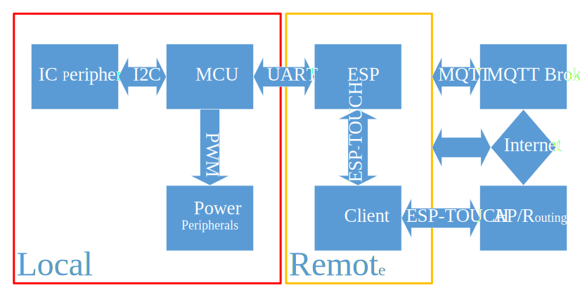

### This is not a complete project

# Smart System Solution

## Tool

- Hardware --> [嘉立创EDA(专业版)](https://lceda.cn/)
    - Schematic👇

    

- Firmware --> [PlatformIO IDE for VSCode](https://platformio.org/)

- Application --> [IntelliJ IDEA Community Edition](https://www.jetbrains.com/idea/)

- MQTT Broker --> [Mosquitto test server](https://test.mosquitto.org/)(Recommended to build own server)

## Framework

## ESP-TOUCH

## Message

## References

- [Getting started with STM32F10xxx hardware development](https://www.st.com/resource/en/application_note/an2586-getting-started-with-stm32f10xxx-hardware-development-stmicroelectronics.pdf)

- [Datasheet_STM32F103x8](https://www.st.com/resource/en/datasheet/stm32f103c8.pdf)

- [RM0008 Reference manual](https://www.st.com/content/ccc/resource/technical/document/reference_manual/59/b9/ba/7f/11/af/43/d5/CD00171190.pdf/files/CD00171190.pdf/jcr:content/translations/en.CD00171190.pdf)

- [USB Type-C Spec R2.3 - October 2023](https://www.usb.org/document-library/usb-type-cr-cable-and-connector-specification-release-23)

- [Datasheet_AMS1117](http://www.advanced-monolithic.com/pdf/ds1117.pdf)

- [ESP-WROOM-02技术规格书](https://www.espressif.com.cn/sites/default/files/documentation/0c-esp-wroom-02_datasheet_cn.pdf)

- [Datasheet_HS96L03W2C03](https://datasheet.lcsc.com/lcsc/2306271450_HS-HS96L03W2C03_C5248080.pdf)

- [Sensirion_Datasheet_SHT4x](https://sensirion.com/media/documents/33FD6951/6555C40E/Sensirion_Datasheet_SHT4x.pdf)

- [Datasheet_BH1750FVI-TR](https://www.mouser.com/datasheet/2/348/Rohm_11162017_ROHMS34826-1-1279292.pdf)

## Credits

- [olikraus/u8g2](https://github.com/olikraus/u8g2)

- [libdriver/sht4x](https://github.com/libdriver/sht4x)

- [libdriver/bh1750fvi](https://github.com/libdriver/bh1750fvi)

- [Espressif Systems.](https://www.espressif.com.cn/)

- [Eclipse Mosquitto™](https://mosquitto.org/)

- [HiveMQ](https://www.hivemq.com/)

- [Jay-Goo/RangeSeekBar](https://github.com/Jay-Goo/RangeSeekBar)

- [EspressifApp/lib-esptouch-android](https://github.com/EspressifApp/lib-esptouch-android)

- [DaveGamble/cJSON](https://github.com/DaveGamble/cJSON)

## Tips

- See the [full list of PlatformIO variables](https://github.com/platformio/platformio-core/blob/develop/platformio/builder/main.py).

- [ESP-AT 用户指南](https://espressif-docs.readthedocs-hosted.com/projects/esp-at/zh-cn/release-v2.2.0.0_esp8266/)

- [MQTT: The Standard for IoT Messaging](https://mqtt.org/)
